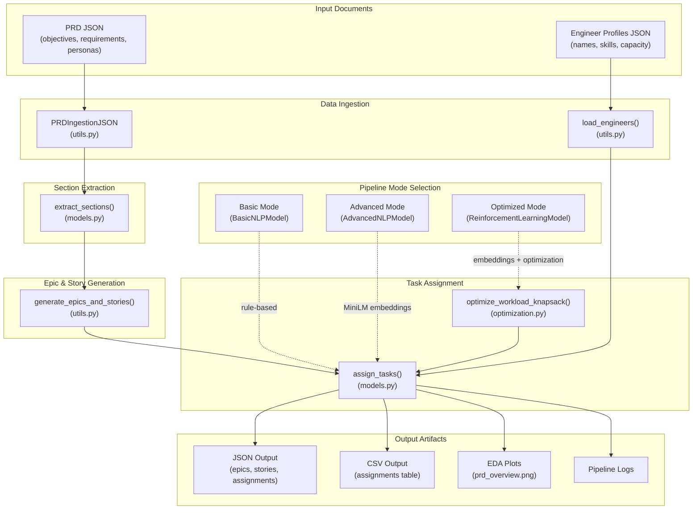

# Architecture Overview

## Document Processing Pipeline

The Smart Document Processing Engine transforms PRD documents and engineer profiles into structured task assignments through a configurable NLP pipeline.

## Pipeline Modes

| Mode | Model Class | Assignment Strategy |
|------|-------------|---------------------|
| `basic` | `BasicNLPModel` | Round-robin distribution across engineers |
| `advanced` | `AdvancedNLPModel` | MiniLM (all-MiniLM-L6-v2) semantic similarity matching |
| `optimized` | `ReinforcementLearningModel` | Embeddings + knapsack dynamic programming optimization |

## Component Reference

### Data Ingestion (`utils.py`)

- **`PRDIngestionJSON`**: Loads and parses PRD JSON files containing objectives, functional requirements, and user personas
- **`load_engineers()`**: Reads engineer profile JSON with skills and capacity data

### NLP Models (`models.py`)

- **`BasicNLPModel`**: Rule-based extraction and round-robin task assignment
- **`AdvancedNLPModel`**: Uses SentenceTransformer embeddings for semantic matching between stories and engineer skills
- **`ReinforcementLearningModel`**: Extends advanced model with optimization layer

### Optimization (`optimization.py`)

- **`optimize_workload_knapsack()`**: Dynamic programming approach to balance workload distribution while maximizing skill-task alignment scores

### Utilities (`utils.py`)

- **`generate_epics_and_stories()`**: Transforms functional requirements into epics and user stories
- **`save_output()`**: Exports results to JSON and CSV formats
- **`evaluate_assignments()`**: Computes precision, recall, F1, BLEU, and ROUGE metrics
- **`perform_eda()`**: Generates exploratory data analysis visualizations

### Entry Points

- **`main.py`**: CLI interface with `--mode`, `--prd_file`, and `--engineers` arguments
- **`app.py`**: Streamlit web interface with interactive mode selection and download buttons

## Data Flow

1. **Load**: PRD and engineer profiles are read from JSON files
2. **Extract**: NLP model extracts relevant sections (objectives, requirements, personas)
3. **Generate**: Functional requirements are converted to epics and user stories
4. **Assign**: Tasks are matched to engineers based on selected mode
5. **Optimize** (if `optimized` mode): Knapsack DP rebalances assignments
6. **Evaluate**: Assignment quality metrics are computed
7. **Export**: Results saved as JSON, CSV, and visualization plots
